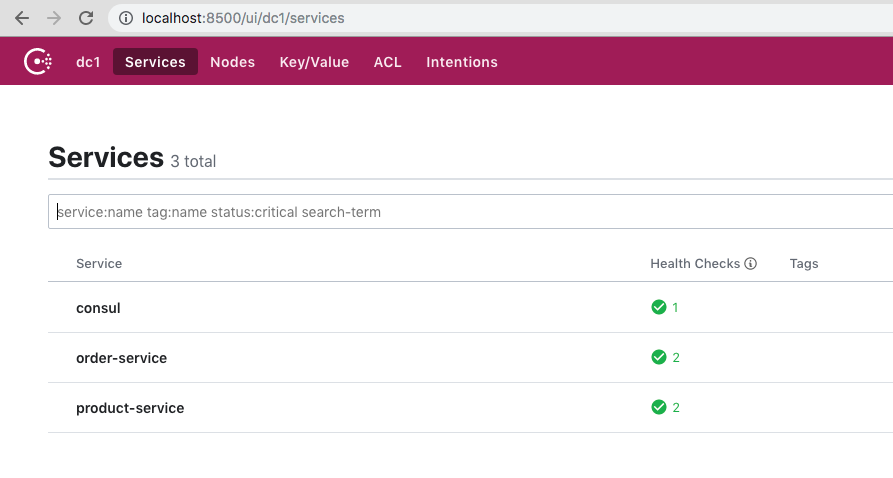

# Arquitectura de Software en la Práctica
## API Gateway

### Objetivos

El objetivo de este práctico es implementar el patrón Service Discovery utilizando el servicio [Consul](https://www.consul.io/)

#### Instalación Consul

Vamos a ejecutar Consul a través de Docker:

```docker run -p 8500:8500 --network=asp-net --name=consul consul```

#### Registro de servicios

Vamos a utilizar servicios de ejemplo presentes en la carpeta ```services```. Para ello los iniciamos a través de Docker compose.

```docker-compose up```

Crear un archivo ```order-service-spec.json``` y agregar el siguiente contenido:

```json
{
    "ID": "order-service",
    "Name": "order-service",
    "Address": "host.docker.internal",
    "Port": 9000,
    "check": {
      "http": "http://host.docker.internal:9000/health",
      "interval": "10s",
      "timeout": "1s"
    }
}
```
esta es la especificación del servicio que se registrará en Consul. Puede registrar mas instancias del servicio simplemente cambiando el atributo *Name*.
Luego ejecutar: 

```curl -X PUT --data-binary @order-service-spec.json http://localhost:8500/v1/agent/service/register```

Crear otro archivo ```product-service-spec.json``` con contenido:

```json
{
    "ID": "product-service",
    "Name": "product-service",
    "Address": "host.docker.internal",
    "Port": 9001,
    "check": {
      "http": "http://host.docker.internal:9001/health",
      "interval": "10s",
      "timeout": "1s"
    }
}
```

y ejecutar:

```curl -X PUT --data-binary @product-service-spec.json http://localhost:8500/v1/agent/service/register```

esto va a registrar el servicio de productos.

Verificar los servicios [aqui](http://localhost:8500/ui/dc1/services).
Si todo está bien debería ver algo similar a lo siguiente:



#### Modificando los servicios

Ahora, debe modificar el servicio *order-service* para que este utilice descubrimiento de servicios por medio de Consul. Para ello seguir los siguientes pasos:

1. Agregar la gema *diplomat*

    ```ruby
    gem 'diplomat'
    ```
2. Dentro de *app.rb* requerir la gema
    ```ruby
    require 'diplomat'
    ```
3. Añadir el descubrimiento de servicios
    ```ruby
    Diplomat.configure do |config|
        config.url = "http://host.docker.internal:8500"
    end

    product_service = Diplomat::Service.get('product-service')
    ```
4. Editar la llamada al servicio de productos
    Cambiar la linea:
    ```ruby
    Faraday.new(url: "http://host.docker.internal:9001")
    ```
    por:
    ```ruby
    Faraday.new(url: "http://#{product_service.ServiceAddress}:#{product_service.ServicePort}")
    ```
5. Detener los servicios y volverlos a iniciar
6. Verificar que la llamada al servicio de órdenes se mantiene inalterada