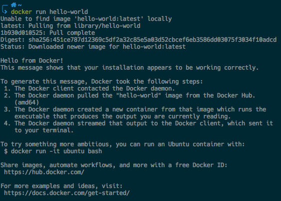
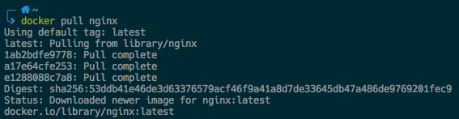
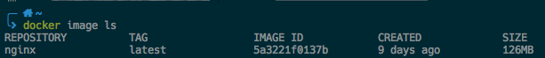
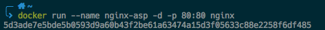
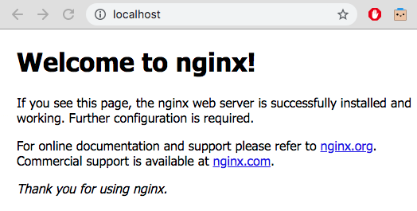
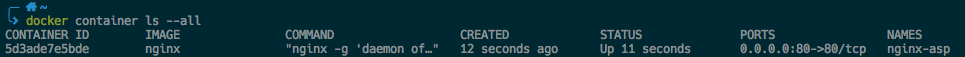

ASP Semana 2 - Clase 1
======================

Introducción a Docker
------

### Instalación

* [MacOS](https://docs.docker.com/docker-for-mac/install/)
* [Linux](https://docs.docker.com/install/linux/docker-ce/ubuntu/)
* [Windows](https://docs.docker.com/docker-for-windows/install/)

Alternativamente se puede usar [Play with docker](https://labs.play-with-docker.com)

### Hello world

Vamos a correr una imagen de ejemplo ejecutando el siguiente comando:

```docker run hello-world```

La salida del comando debería ser la siguiente:



Tomarse unos minutos para analizar la salida y discutir cada uno de los puntos.

### Nginx en Docker

Nginx es un servidor web/proxy inverso ligero de alto rendimiento muy popular, en esta instancia vamos a ejecutarlo desde Docker.

1. [Obtener la imagen](https://docs.docker.com/engine/reference/commandline/pull/) oficial de Nginx desde [Dockerhub](https://hub.docker.com/_/nginx)

    ```docker pull nginx```

    

    **Nota:** Observe como por defecto se obtiene la última versión de la imagen. Para utilizar otra imagen puede especificar el tag de la siguiente manera: ```docker pull nginx:1.17.3```

2. Listar imágenes presentes en el sistema

    ```docker image ls```

    

    En la imagen anterior podemos visualizar el listado de imágenes de Docker presentes en el sistema. En este caso tenemos una sola imagen del [repositorio](https://docs.docker.com/docker-hub/repos/) *nginx* con el *tag* *latest*

3. Ejecutar la imagen de Nginx

    ```docker run --name nginx-asp -d -p 80:80 nginx```

    

    ¿Qué son todos esos parámetros?, para averiguarlo utilice la ayuda del comando ```docker run --help```

    Ir a su navegador web y tipar ```localhost```

    

    Hemos ejecudato satisfactoriamente Nginx en Docker!.

4. Listar los contenedores

    ```docker container ls --all```

    

### Comandos útiles

* ```docker <command> --help``` Ayuda sobre los comandos
* ```docker container ls --all``` Lista todos los contenedores
* ```docker stop <container-name/container-id>``` Detiene el contenedor especificado
* ```docker start <container-name/container-id>``` Inicia el contenedor especificado
* ```docker rm <container-name/container-id>``` Borra el contenedor especificado
* ```docker image ls``` Lista las imágenes presentes en el sistema
* ```docker rmi <image-name/image-id>``` Borra la imagen especificada
* ```docker system prune -a``` Borra todas las imágenes, volúmenes y contenedores sin usar


