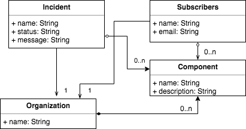

# Arquitectura de Software en la Práctica

## Mails & background jobs

La siguiente aplicación es un ejemplo de gestión de incidencias de una plataforma con envío de mails en rails. Para esto nos basamos en en siguiente modelo:



Los posibles estados de una incidencia son:

* Investigating
* Identified
* Monitoring
* Resolved

## Procedimiento

```ruby
rails generate model organization name:string

rails generate model component name:string description:string

rails generate scaffold subscribers name:string email:string

rails generate scaffold incident name:string status:string message:string

rails generate migration AddOrganizationToIncident organization:references

rails generate migration AddOrganizationToSubscriber organization:references

rails generate migration AddOrganizationToComponent organization:references

rails generate migration CreateJoinTableSubscribersComponents subscribers components

rails generate migration CreateJoinTableIncidentsComponents incidents components
```

Agregar en los modelos las relaciones:

* Incident:
    ```
    belongs_to :organization
    has_and_belongs_to_many :components
    ```
* Subscriber: 
    ```
    belongs_to :organization
    has_and_belongs_to_many :components
    ```
* Component:
    ```
    belongs_to :organization
    has_and_belongs_to_many :subscribers
    ```
## Envíos de emails

Para simular la recepción de correos en localhost puede utilizar la [Mailcatcher](https://mailcatcher.me). Luego debe modificar el archivo: ```config/environments/development.rb```

```ruby
config.action_mailer.perform_deliveries = true
config.action_mailer.delivery_method = :smtp
config.action_mailer.smtp_settings = { address: "127.0.0.1", port: 1025 }
```

## Datos de prueba

Puede cargar los siguientes datos de prueba en el archivo ```seeds.rb```

```ruby
if Organization.count == 0 
    petstore = Organization.create! name: "Petstore"
    toys = Organization.create! name: "Toys"

    petStoreComponents = ['iOS App', 'Android App', 'Backoffice', 'Orders service', 'Stock service']
    toysComponents = ['Web App', 'Backoffice', 'Orders service', 'Stock service', 'Payments service']

    petStoreComponents.each do |component|
        Component.create! organization: petstore, name: component, description: "#{component} component for #{petstore.name}"
    end

    toysComponents.each do |component|
        Component.create! organization: toys, name: component, description: "#{component} component for #{toys.name}"
    end

    (1..5).each do |subscriberId|
        Subscriber.create! name: "Subscriber ##{subscriberId}", email: "example#{subscriberId}@mail.com", components: [Component.where(organization_id: Organization.first.id).first]
    end
    Incident.create! name: "Uuups!", status: "investigating", message: "Problems in petstore!", components: [Component.where(organization_id: Organization.first.id).first], organization: Organization.first
end
```

## Desafío

### Envío de correo

Definir un método en la clase **ApplicationMailer** para realizar el envío de correos cada vez que se guarde un inciente (o se actualice) a todas las personas suscriptas.
Para mas información sobre el envío de correos ingresar [aquí](https://guides.rubyonrails.org/action_mailer_basics.html)
Se sugiere utilizar los hooks de **ActiveRecord**.
Comparar el envío instantáneo (**deliver_now**) vs el envío postergado (**deliver_later**).

### Estado de incidencias

El sistema debe verificar que no hayan incidencias en el estado **Monitoring** por mas de 10 minutos, en caso de que exista la incidencia se pasa automáticamente al estado de **Resolved**