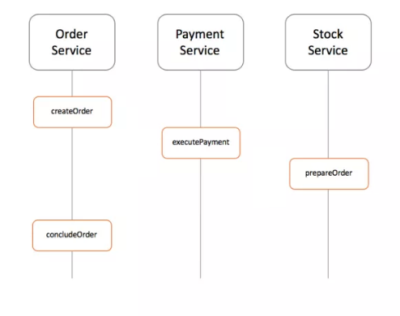

# Arquitectura de Software en la Práctica
## Saga Pattern

### Objetivos

El objetivo de este práctico es implementar el patrón saga. Para esto nos basaremos en un ejemplo de un sistema de *e-commerce* que consta de tres microservicios:

* *order-service*: Registra una órden de compra. De cada órden se conoce: id, usuario, lista de ids de productos (con su respectivos precios), el total de la compra y el identificador del medio de pago.
* *payment-service*: Contiene los medios de pago por usuario en modo "billetera electrónica". Al registrar un pago se debe especificar identificador del pago, identificador del usuario y total de la compra. El sistema valida si ese usuario tiene fondos para ese medio de pago.
* *stock-service*: Contiene la cantidad de productos disponibles. Al registrar una compra se debe decrementar y validar que exista stock suficiente.

### Saga

La saga a implementar es el proceso de una órden de compra:

1. Se crea la órden en el servicio de órdenes
2. Se ejecuta el pago en el servicio de pagos
3. Se calcula el stock en el servicio de stock
4. Se finaliza el proceso de registro de compra

### Implementación

* Se recomenienda partir de los esqueletos de servicios disponibles [aquí](https://github.com/pablovilas/asp-course-examples/tree/master/s12/s12c1)
* Puede elegir libremente entre cualquier forma de implementación:
    * **Events/Choreography**: Sin coordinacion central, cada servicio produce los eventos y procesa eventos de los demás servicios y decide si debe tomar una acción o no.
    * **Command/Orchestration**: Existe un servicio que coordina la saga y secuencia la lógica del negocio.

#### Ejemplo de proceso con Events/Choreography

1. *order-service* guarda una nueva órden, pone el estado como *pending* y dispara el evento *ORDER_CREATED*
2. *payment-service* escucha por el evento *ORDER_CREATED* realiza el cobro al usuario y publica el evento *BILLED_ORDER*
3. *stock-service* escucha por el evento *BILLED_ORDER* actualiza el stock y publica el evento *ORDER_PREPARED*
4. Por último *order-service* escucha por los eventos *ORDER_PREPARED* actualiza el estado a *preparing* y se finaliza la saga

**Nota**: Considerar también casos alternativos, ejemplo: PRODUCT_OUT_OF_STOCK, USER_NO_FOUNDS