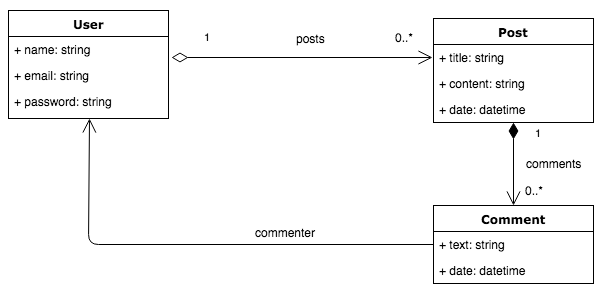

# Arquitectura de Software en la Práctica
## Aplicación Rails de ejemplo

### Objetivos

El objetivo de este práctico es realizar una aplicación de ejemplo que sirva como punto de partida para utilizar a lo largo del curso.
*ASPost* es una aplicación en Rails donde las personas pueden postear contenido y comentar los posts de otras personas.

### Diagrama de clases

* **User:** es el usuario del sistema, donde se conoce su nombre, email, password y la lista de posts que escribió.
* **Post:** contenido generado por cada usuario. Cada post tiene un título, contenido y la fecha de su creación. Por cada post se permite realizar comentarios.
* **Comment:** son los comentarios asociados a cada post realizados por usuarios. Cada comentario tiene un texto que es escrito por la persona que comenta y la fecha en cual fue realizado.

### Funcionalidad

Se deberá desarrollar una sección donde se listen todos los post ingresados hasta el momento, indicando título, fecha y nombre del usuario que lo realizó.

Debe ser posible hacer click en el título del post y acceder a la vista de detalle del mismo. En la vista de detalle se muestra el título, fecha de creación, autor y contenido. 

Además, en la vista de detalle se deben poder ver los comentarios hechos en ese post mostrando el texto del comentario, la fecha y el usuario que lo realizó. 

Esta primer etapa de la aplicación *solo va a mostrar información*, por lo que se generarán datos de ejemplo para la base a traves del archivo *seeds*.

Puede partir de este ejemplo y agregar la funcionalidad solicitada.

### Requerimientos no funcionales

* La aplicación tiene que estar desplegada en un servicio Paas, preferentemente [Heroku](https://www.heroku.com/home). Puede consultar la lista de comandos mas utilizados [aquí](https://devhints.io/heroku).
* La base de datos debe ser postgres. En ambiente de desarrollo se recomienda utilizar [docker](https://hub.docker.com/_/postgres), en producción puede utilizar una base [gestionada](https://elements.heroku.com/addons/heroku-postgresql) por el proveedor. 
* Toda información sensible debe estar como variables de entorno. Se sugiere utilizar la gema [dotenv](https://github.com/bkeepers/dotenv) para facilitar el desarrollo.
* Se debe considerar la observabilidad del sistema por medio de logs los cuales deben estar visibles desde algún servicio para cualquier eventualidad. Puede utilizar [loggly](https://www.loggly.com), [insightops](https://insight.rapid7.com/login), etc.
