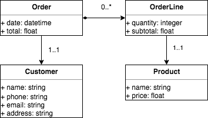

# Arquitectura de Software en la Práctica

## Testing en rails

### Objetivos

El objetivo de este práctico es realizar una aplicación de ejemplo con testing automatizado que sirva como punto de partida para utilizar a lo largo del curso.

### Diagrama de clases

A continuación se muestra un diagrama de clases de ejemplo:



**Order:** Representa una compra con su respectiva fecha de compra y total.
**OrderLine:** Son las lineas (o detalles) de la compra. Es decir que productos y cantidades de los mismos fueron adquiridos.
**Product:** Representa al producto que está en venta. De los productos conocemos su nombre y precio.
**Customer:** Es el cliente que realiza la compra. De los clientes sabemos su nombre, teléfono, email y dirección.

### Validaciones

Con la finalidad de mantener consistencia en los datos ingresados se desea agregar las siguientes [validaciones](https://guides.rubyonrails.org/active_record_validations.html):

#### Customer

* El nombre del cliente no debe ser vacío.
* El teléfono del cliente debe estar en formato internacional. Puede utilizar una [expresión regular](https://www.oreilly.com/library/view/regular-expressions-cookbook/9781449327453/ch04s03.html).
* El email debe ser un correo válido.
* La dirección no debe estar vacía.

#### Product

* El nombre no debe estar vacío y debe ser único.
* El precio del producto tiene que ser mayor que cero.

#### OrderLine

* La cantidad de productos debe ser mayor que cero.
* El subtotal debe ser exactamente la cantidad de productos * precio del producto. Ver ejemplo de esas validaciones [aquí](https://guides.rubyonrails.org/active_record_validations.html#custom-methods).

#### Order

* La fecha de la ordén tiene que ser exactamente igual a cuando se almacena en la base de datos. Puede usar [callbacks](https://guides.rubyonrails.org/active_record_callbacks.html) para esto.
* El total de la órden debe ser la suma del subtotal de las lineas.

### Procedimiento

1. Crear un nuevo proyecto rails.
    ```rails new testing```
2. Agregar los modelos y asociaciones correspondientes de acuerdo al diagrama de clases. Recuerde el comando:
    
    ```rails generate model <model_name> <attribute>:<attribute_type>```

    ```rails generate migration <migration_name> <reference>```

    Ejemplo:

    ```rails generate model product name:string price:number```
    ```rails generate migration AddProductToOrderLine product:references```
3. Agregar las validaciones solicitadas.
4. Realizar test unitario de los modelos con al menos un caso de éxito y un caso de falla para  cada validación.