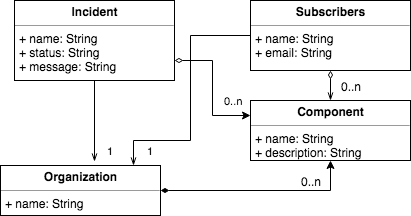

# Arquitectura de Software en la Práctica

## Mails & background jobs

La siguiente aplicación es un ejemplo de gestión de incidencias de una plataforma con envío de mails en rails. Para esto nos basamos en en siguiente modelo:



## Procedimiento

```
rails generate model organization name:string

rails generate model component name:string description:string

rails generate scaffold subscribers name:string email:string

rails generate scaffold incident name:string status:string message:string

rails generate migration AddOrganizationToIncident organization:references

rails generate migration AddOrganizationToSubscriber organization:references

rails generate migration AddOrganizationToComponent organization:references

rails generate migration CreateJoinTableSubscribersComponents subscribers components

rails generate migration CreateJoinTableIncidentsComponents incidents components
```

Agregar en los modelos las relaciones:

* Incident:
    ```
    belongs_to :organization
    has_and_belongs_to_many :components
    ```
* Subscriber: 
    ```
    belongs_to :organization
    has_and_belongs_to_many :components
    ```
* Component:
    ```
    belongs_to :organization
    has_and_belongs_to_many :subscribers
    ```
## Envíos de emails

Para simular la recepción de correos en localhost puede utilizar la siguiente herramienta: https://mailcatcher.me
Luego debe modificar el archivo ```config/environments/development.rb```

```
config.action_mailer.perform_deliveries = true
config.action_mailer.delivery_method = :smtp
config.action_mailer.smtp_settings = { address: "127.0.0.1", port: 1025 }
```
